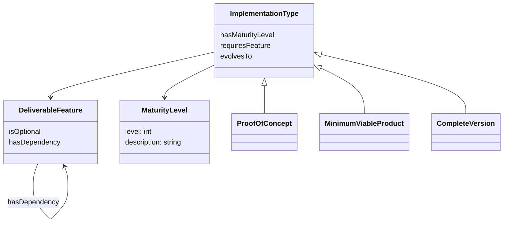
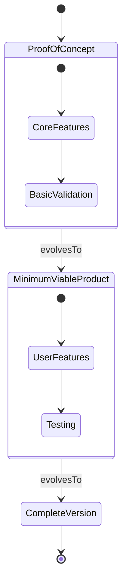

# [Ontology for Implementation Types and Completion Criteria](https://claude.ai/chat/ee24375b-76b1-413f-bfda-23613830a5dc)

10cf208a-6074-441a-a3dc-4c4bec3b5a92

 

<antArtifact identifier="implementation-types-spec" type="text/markdown" title="Implementation Types & Completion Criteria Specification">
# Implementation Types & Completion Criteria Specification

## Overview
Framework for representing software implementation types (PoC, MVP etc.) and their completion criteria in an ontology, with rule-based validation.

## Requirements
- Define distinct implementation types with clear boundaries 
- Support evolution between implementation stages
- Express required and optional features
- Validate completion criteria
- Integrate with existing goal/task structures

## Conceptual Model





## Implementation Approach

### Core Ontology Structure
```turtle
@prefix : <http://example.org/implementation#> .
@prefix owl: <http://www.w3.org/2002/07/owl#> .
@prefix rdfs: <http://www.w3.org/2000/01/rdf-schema#> .

:ImplementationType a owl:Class ;
    rdfs:subClassOf :DeliveryType .

:ProofOfConcept a owl:Class ;
    rdfs:subClassOf :ImplementationType .

:MinimumViableProduct a owl:Class ;
    rdfs:subClassOf :ImplementationType .

:CompleteVersion a owl:Class ;
    rdfs:subClassOf :ImplementationType .

:evolvesTo a owl:ObjectProperty ;
    rdfs:domain :ImplementationType ;
    rdfs:range :ImplementationType ;
    a owl:TransitiveProperty .

:hasRequiredFeature a owl:ObjectProperty ;
    rdfs:domain :ImplementationType ;
    rdfs:range :DeliverableFeature .

:hasOptionalFeature a owl:ObjectProperty ;
    rdfs:domain :ImplementationType ;
    rdfs:range :DeliverableFeature .
```

### Feature Requirements
- Required features defined through OWL cardinality restrictions
- Optional features through qualified cardinality 
- Dependencies expressed through object properties
- Feature sets composed through unions/intersections

### Validation Rules
N3 rules for completion validation:
```n3
# Base completion rule
{?x :hasRequiredFeature ?f . ?x :hasImplementedFeature ?f} => {?x :meetsRequirement ?f} .

# Full completion
{?x :hasRequiredFeature ?f . 
 ?f :hasDependency ?d .
 ?x :meetsRequirement ?f .
 ?x :meetsRequirement ?d} => {?x :isComplete true} .
```

### Integration Points
- Links to goals/tasks through task decomposition properties
- Maturity progression tracked via evolution properties
- Feature dependencies managed through explicit relations
- Validation results propagated to task status

### Extensibility
- New implementation types added as subclasses
- Custom feature sets through class composition
- Additional rules for specific validation needs
- Flexible property patterns for integration
</antArtifact>

q1: Should we add specific validation rules for each implementation type?
q2: How should feature sets be versioned over time?
q3: Could we use semantic versioning concepts in the ontology?
q4: Would named graphs help manage different implementation stages?

---

* **sourceFile** : /home/danny/github-danny/hyperdata/docs/chat-archives/data-2025-01-25-12-45-58/conversations.json
* **appName** : claude-json-converter
* **appPath** : claude-json-converter
* **subtask** : [undefined]
* **rootDir** : /home/danny/github-danny/transmissions/src/applications/claude-json-converter
* **dataDir** : /home/danny/github-danny/transmissions/src/applications/claude-json-converter/data
* **targetPath** : /home/danny/github-danny/transmissions/src/applications/claude-json-converter/data
* **tags** : ccc10.ccc20.ccc30.ccc40.ccc50
* **done** : [undefined]
* **meta** : {
  "conv_uuid": "ee24375b-76b1-413f-bfda-23613830a5dc",
  "conv_name": "Ontology for Implementation Types and Completion Criteria",
  "updated_at": "2024-12-04T10:02:54.986506Z"
}
* **filepath** : /home/danny/github-danny/hyperdata/docs/postcraft/content-raw/chat-archives/md/ee24/2024-12-04_10c.md